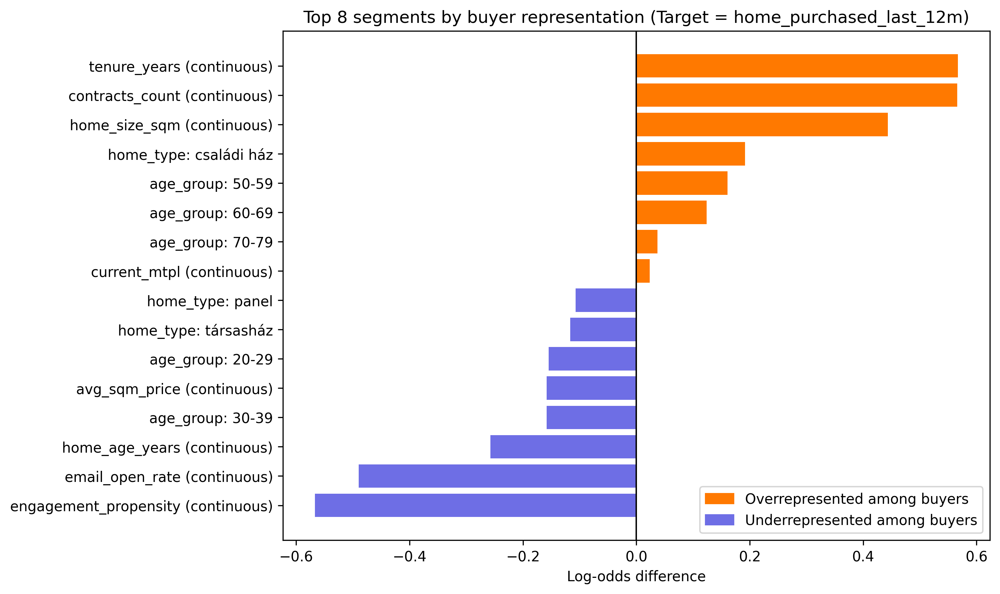
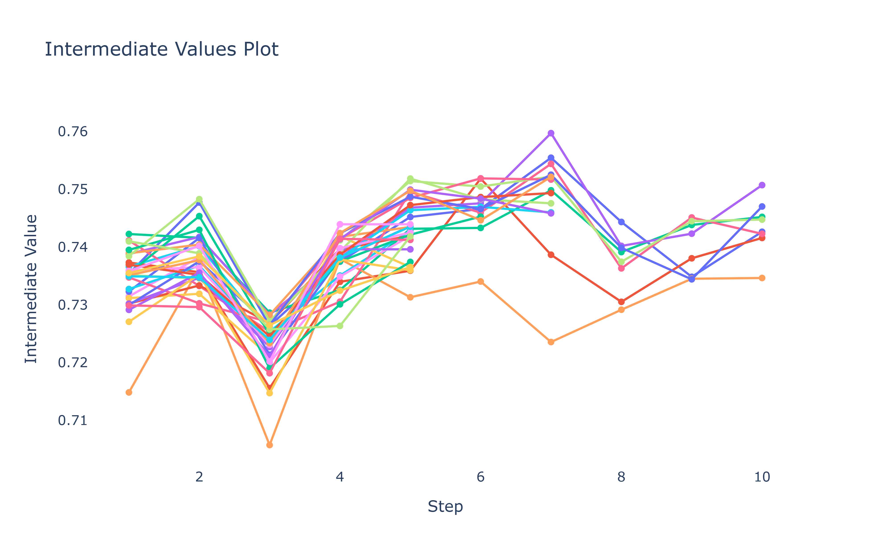
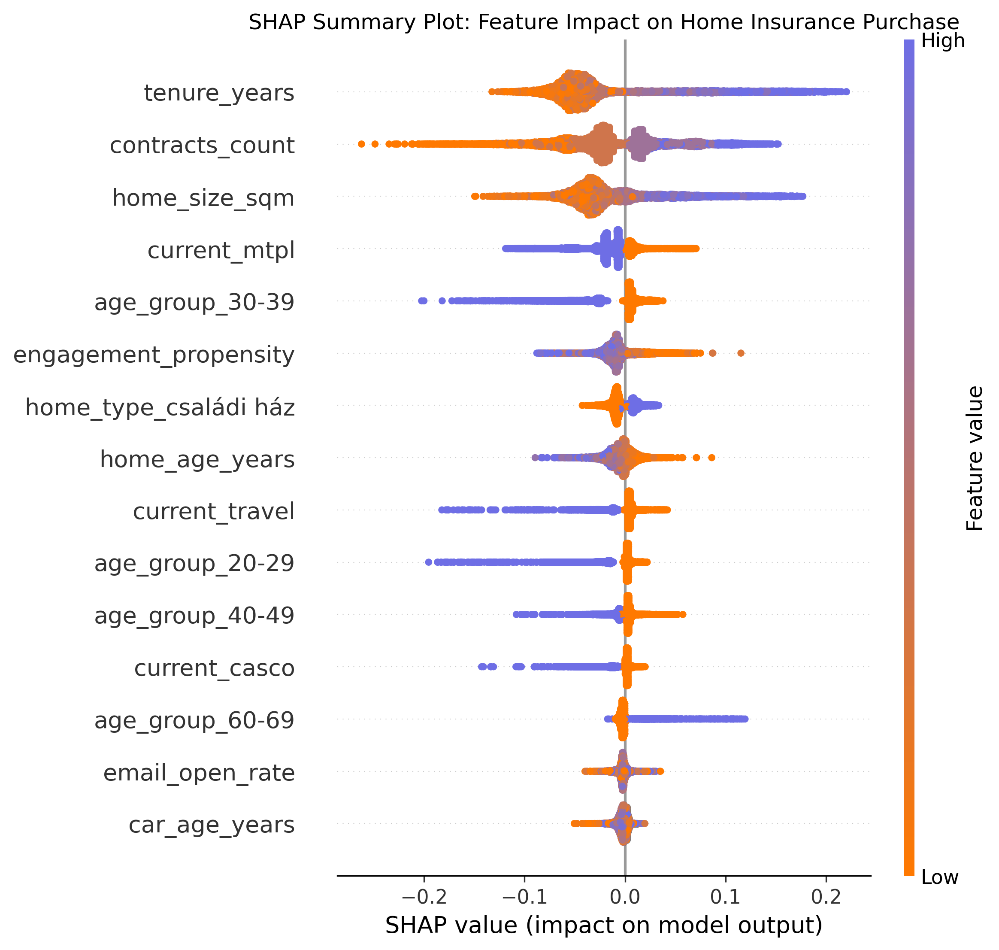
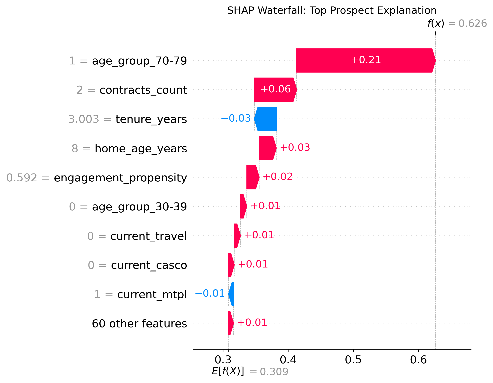
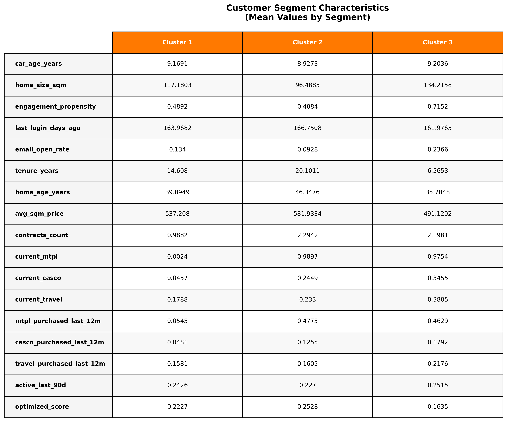
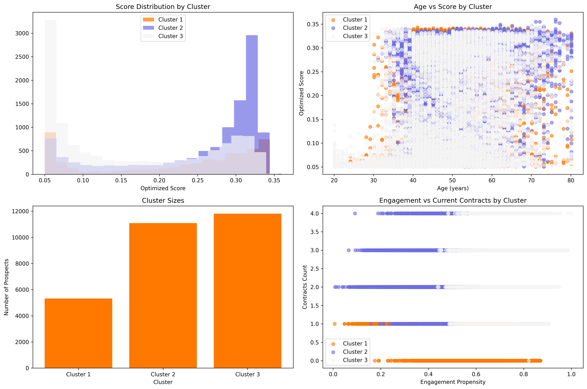

# Netrisk Lakásbiztosítás - feladatmegoldás

_Készítette: Mazzag Bálint_

_Dátum: 2025. november 27._

## Vezetői összefoglaló

Az előző lakásbiztosítási kampány által targetált ügyfelek elemzése alapján a legnagyobb különbség a konvertált és nem konvertált ügyfelek között az alábbi változók szerint alakul:

- Netrisk regisztrációtól eltelt idő hosszabb ~ inkább konvertált
- Netrisknál vezetett szerződések száma nagyobb ~ inkább konvertált
- Ház vagy lakás alapterület nagyobb ~ inkább konvertált
- Engagement propensity score magas ~ inkább nem konvertált
- Email megnyitásának aránya magas ~ inkább nem konvertált
- Ház vagy lakás kora idős ~ inkább nem konvertált

Ezek után egy predikciós modell került kialakításra, amely az ügyfelek attribútumai alapján azt jelzi előre, hogy mekkora valószínűséggel konvertálnak egy következő kampány során. A változók ezáltal a modellben betöltött fontosságuk és összhatásuk alapján is kategorizálásra kerültek, valamint a jelenlegi ügyfél-adatbázisra egy százalékos értéket határozhatunk meg, amely a konvertálás valószínűségét jelzi.

Ez az érték nagyjából 35%-on tetőzik, de a 250 000 elemzett ügyfél nagyjából 90%-énél, 5% alatti, így **körülbelül 28 216 magas potenciálú felhasználót érdemes targetálni egy optimalizált kampányban**. Költségtől függően az alacsonyabb valószínűségértékkel rendelkező felhasználók is bevonhatóak a kampányba.

A magas potenciálú ügyfelekre pedig klaszterek szerint az alábbiak jellemzőek:

1. klaszter ~ átlagos érték: 22% (5 318 fő): oktatóm, bizalomépítő és bemutató email kampány, amely megismerteti a Netrisken elérhető lakásbiztosítási lehetőségeket
2. klaszter ~ átlagos érték: 25% (11 088 fő): meglévő lakásbiztosítás megújítására célzó, vagy a Netrisk kiegészítő szolgáltatásait bemutató kampány. Idősebb ügyfelek, így Facebook vagy akár telefonos úton is célozhatóak.
3. klaszter ~ átlagos érték: 16% (11 810 fő): vagyonosabb, utazásokat szerető ügyfelek, akik emailen keresztül célozhatóak, leginkább a ház, mint értékes vagyontárgy védelmével, és az online ügyintézés egyszerűségét kiemelve.

A három klaszter alapján differenciáltan érdemes a legértékesebb ügyfeleket megszólítani, először a 2. klaszterbe tartozó 11 000 ügyfélre fókuszáltan üzenetet kialakítani.

Ezután a többi két csoportot akár költséghatékonyabb, email és közösségi médiás kampánnyal érdemes megszólítani, mivel ezen csoportok középkorú, már korábbi szerződésekkel is több esetben rendelkező ügyfelek, akik aktívabbak az emailes kommunikáció fogyasztásában is.

Végül pedig a fókuszból kimaradt, de úgy is 2-5%-os értéket elérő ügyfelek következnének, valamint a korábbi lakásbiztosított ügyfelek megújításra szóló kampánya is figyelmet kell, hogy kapjon. Azonban ez utóbbi eset nem képezte a jelenlegi modellezésünk részét.

## 1. Adatelőkészítés és Feature Engineering

- A megadott táblázatot tisztítani szükséges volt, az ügyfelek közül 30%-hoz nem rendelkeztünk autó típus és életkor adattal, ugyanakkor a hiányzó adatok pótlását nem MICE algoritmussal, hanem csoportképzéssel oldottam meg, mivel feltételeztem, hogy _az adathiány strukturális okhoz köthető_.
- Minden ügyfélhez rendelkezünk irányítószámmal, ez ugyanakkor mintaadat lévén sajnos nem minden esetben valós magyar irányítószám. Emiatt csak a megyei adathoz tudtam a háztípusának megfelelő átlagárat kötni, amely a KSH Ingatlanadattárából származik ([LINK](https://www.ksh.hu/s/ingatlanadattar/)). Az adatok irányítószám szinten is rendelkezésre álltak volna.
- A marketing funkciókhoz közelebb álló csoportokat alkottam bizonyos oszlopokból. Az életkorból 10 éves target groupokat képeztem, míg a regisztráció időpontját a mai dátummal alakítottam át eltelt napok számára (_tenure_years_)

## 2. Feltáró adatelemzés

A lakásbiztosítással rendelkező ügyfeleket két változó alapján is meg lehet fogni, azonban a feltett kérdés általam értelmezve a b) opcióra fókuszál.

- a) `current_home` – Jelenleg lakásbiztosítással rendelkezik
- b) `home_purchased_last_12m` – Vásárolt lakásbiztosítást az elmúlt 12 hónapban

A lakásbiztosítást vásárolt ügyfeleket el tudjuk különíteni a megadott változók és oszlopok nyomán, ugyanakkor egy log-odds rátát használva láthatjuk azt is, hogy melyik numerikus vagy kategorikus változó az, amelyik a legnagyobb különbséget jelenti a két csoport között. Ezek azok a jellemzők, amelyek leginkább elkülönítik a jelenlegi vásárlókat. Ellenőrzésképpen egy ugyanilyen elemzést készítettem a másik a) pontban meghatározott változóra is, amely hasonló top 6 változót mutatott.

### Lakásbiztosítással rendelkező ügyfelek jellemzői

- Netrisk regisztrációtól eltelt idő nagyságа ~ inkább konvertált
- Netrisknál vezetett szerződések száma ~ inkább konvertált
- Ház vagy lakás alapterület nagyságа ~ inkább konvertált
- Engagement propensity score ~ inkább nem konvertált
- Email megnyitásának aránya ~ inkább nem konvertált
- Ház vagy lakás kora ~ inkább nem konvertált

### Log-odds Elemzés

A következő ábra mutatja, hogy mely változók különböztetik meg leginkább a lakásbiztosítást vásárló és nem vásárló ügyfeleket:

## 3. Predikciós Modell

### Modellválasztás

XGBoost modellt készítettem, amely a fenti b) `home_purchased_last_12m` változót vette figyelembe, mint célváltozó, hiszen feltételeztem, hogy az _előző kampány miatt kerültek be jelenleg lakásbiztosítással rendelkező ügyfelek a rendszerbe_. A modell kimenete egy **valószínűségi érték**, amely megmutatja, hogy mekkora valószínűséggel konvertál az ügyfél egy következő lakásbiztosítási kampány során.

A modell hiperparamétereinek optimalizálására Optuna csomagot használtam, így a modell kimenetét és az előrejelzést a legkevésbé befolyásolják a kezdeti specifikációs értékei. Végül SHAP módszerekkel elemeztem az XGBoost eredményeit, így a fekete doboz-szerű modellből a hatásokat külön-külön bemutató vizuális kimenetekkel tudtam a konklúziókat levonni a legfontosabb változók, és így a marketing célcsoport tekintetében.

10-szeres, rétegzett keresztvalidációt használtam a hiperparaméterek optimalizálására. Az alábbi interaktív ábra mutatja az optimalizálási folyamatot:

### Hiperparaméterek optimalizálása

_Az ábra megjeleníti, hogyan javultak a modell teljesítménymutatói az egymást követő próbák során._

### Változók fontossága

A következő ábra az optimalizált XGBoost modell legfontosabb változóit mutatja. Egy változó melletti pontok az adott változó predikciós értékre való hatását mutatja meg minden, a modellbe bevont adatpointnál. A narancssárga az alacsony érték, míg a lila a magas érték melletti hatást mutatja meg az adott változónál.

Így láthatjuk, hogy a modellben a _tenure years_, tehát a regisztráció óta eltelt évek száma, rendelkezik a legnagyobb pozitív hatással. Míg magas pozitív hatással van a szerződések magas száma, valamint a ház nagyságа. Ezen változók megjelentek a korábbi, szegmentációs elemzésben is.

Azonban a jelenlegi KGFB szerződés, valamint a 30-39 közötti életkor csoportja és a magas engagement propensity score negatív irányba befolyásolja a szerződéskötés valószínűségét.

Hogyha megvizsgáljuk a legmagasabb valószínűségű ügyfelek közül egyet, akkor látható, hogy a valószínűség normált értékét (egy folytonos változóként vizsgálva, nem pedig 0-1 között) mekkora mértékben befolyásolják a különböző attribútumok.

Például a 70-79 közötti életkor van a legnagyobb hatással, míg a 2 szerződés a második legfontosabb, azonban a regisztrációja csak 2 éve volt, így ez csökkenti a lakásbiztosítás megkötésének esélyét a modell szerint.

## 4. Ügyfélszegmentáció

A legkiemelkedőbb (5% valószínűség feletti) ügyfeleket külön elemezve 3 fő klasztert lehet elkülöníteni.

1. klaszter ~ átlagos érték: 22% (5 318 fő):
   Autóhoz kötődő biztosítást nem vásárolt, nem is rendelkezik autóval, jellemzően 40-49, alacsony jelenlegi kontraktus számmal rendelkezik, azonban nagyából már 15 éve ügyfele a cégnek, és jellemzően családi házban lakik, amely átlagosan 40 éve épült.

Optimális üzenet és csatorna: oktatói, bizalomépítő és bemutató email kampány, amely bemutatja a lakásbiztosítási lehetőségeket

2. klaszter ~ átlagos érték: 25% (11 088 fő):
   A legmagasabb átlagéletkorű, és leghosszabb ideje Netrisk ügyfelek, akiknek korábban volt már több típusú biztosításuk, átlagosan 2.2 db és majdnem 50%-uknak KGFB-jük is az elmúlt 12 hónapban. Emaileket azonban kevésbé olvassák, csak átlagosan 9%-át nyitják meg.

Optimális üzenet és csatorna: meglévő lakásbiztosítás megújítására célzó, vagy a Netrisk kiegészítő szolgáltatásait bemutató kampány. Idősebb ügyfelek, így Facebook vagy akár telefonos úton is célozhatóak.

3. klaszter ~ átlagos érték: 16% (11 810 fő):
   A legmagasabb házmérettel rendelkező, legaktívabb (engagement), és magas szerződésszámmal rendelkező, azonban jellemzően 40-49 éves ügyfelek, akik még csak átlagosan 6 éve a Netrisk regisztrált felhasználói, tehát korán, több szerződéskötésben is érdekeltek voltak. 97%-uknak jelenleg is van KGFB-jük, ugyanakkor jellemzően utasbiztosítást is kötnek. Emailek megnyitási rátájuk 23%.

Optimális üzenet és csatorna: vagyonosabb, utazásokat szerető ügyfelek, akik emailen keresztül célozhatóak, leginkább a ház, mint értékes vagyontárgy védelmével, és az online ügyintézés egyszerűségét kiemelve.

A három klaszter alapján differenciáltan érdemes a legértékesebb ügyfeleket megszólítani, először a 2. klaszterbe tartozó 11 000 ügyfélre fókuszáltan üzenetet kialakítani.

Ezután a többi két csoportot akár költséghatékonyabb, email és közösségi médiás kampánnyal érdemes megszólítani, mivel ezen csoportok középkorú, már korábbi szerződésekkel is több esetben rendelkező ügyfelek, akik aktívabbak az emailes kommunikáció fogyasztásában is.

Végül pedig a fókuszból kimaradt, de úgy is 2-5%-os értéket elérő ügyfelek következnének, valamint a korábbi lakásbiztosított ügyfelek megújításra szóló kampánya is figyelmet kell, hogy kapjon. Azonban ez utóbbi eset nem képezte a jelenlegi modellezésünk részét.

## Melléklet

Minden kód és kimenet elérhető az alábbi GitHub repoban: [https://github.com/mbalint9901/Netrisk_Project](https://github.com/mbalint9901/Netrisk_Project)

### Adatforrások

- Netrisk ügyfél adatbázis
- KSH Ingatlanadattár 2024
